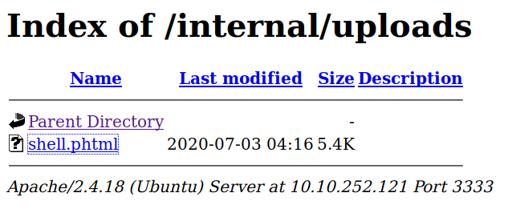
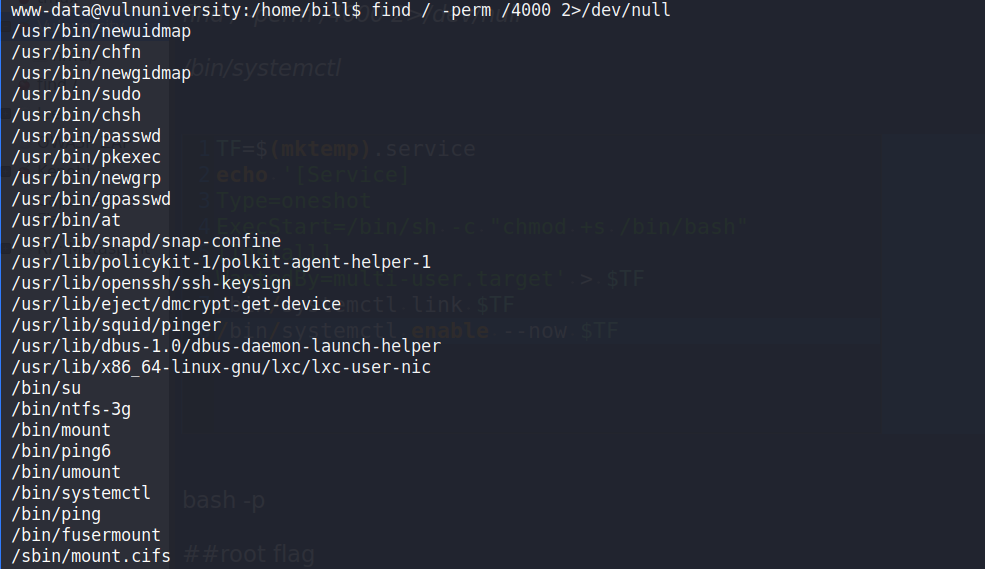
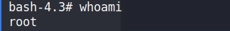

# VulnUniversity
## WriteUp TryHackme [VulnUniversirty](https://tryhackme.com/room/vulnversity)


### Task 1 

#1 No answer needed

### Task 2 Reconaissance

#1 Scan this box: nmap -sV <machines ip>
``` 
My default is nmap -sC -sV -oN nmap/initial <machines ip>
``` 

#2 Scan the box, how many ports are open?
```
nmap Results
```
#3 What version of the squid proxy is running on the machine?
```
nmap Results
```
#4 How many ports will nmap scan if the flag -p-400 was used?
```
man nmap
```
#5 Using the nmap flag -n what will it not resolve?
```
man nmap
```
#6 What is the most likely operating system this machine is running?
```
nmap Results
```
#7 What port is the web server running on?
```
nmap Results
```
*******************

### Task 3 Locating directories using GoBuster
```
I used dirsearch, output file has been included

dirsearch.py -u http://10.10.252.121:3333 -e* -x 403 -t 100
```
[dirsearch](https://github.com/maurosoria/dirsearch)

#2 What is the directory that has an upload form page?
```
dirsearch results
```
*****************
### Task 4 Compromising the webserver

#1  Try upload a few file types to the server, what common extension seems to be blocked? 
```
I tried uploading php, html files since it is an apache server. On uploading php it seems to be blocked
```

#2 On running the intruder attack given
```
.phtml file is uploaded
```

*Now since we know .phtml files can be uploaded
we upload a php reverse shell in the server
[pentestmonkey's php reverse shell](https://github.com/pentestmonkey/php-reverse-shell)
same reverse shell is provided in the repository as well copy it and change the IP and port number*

*Start a netcat listener*

`nc -nvlp <port specified in the reverse shell>` 

*Now upload the file and navigate to /internal/uploads/* 


*Now click on your uploaded php file on clicking that check your terminal **Congrats !!** you have got a reverse shell*

#5 What is the name of the user who manages the webserver?
```
running ps or navigating to /home you will find an user bill
```
#6 What is the user flag?
```
cat /home/bill/user.txt
```
*************
### Task 5 Privilege Esclation
#1 On the system, search for all SUID files. What file stands out?
```
This command will find all the files in the system with suid bit set and redirect the error

find / -perm /4000 2>/dev/null
```


```
usually systemctl does not have a suid bit set
```

[GTFOBins](https://gtfobins.github.io/gtfobins/systemctl/)

*I found the above resource to be useful for privilege esclation i have made a copy of the above commands in test file you can exactly copy them on your shell (www-data) and then run the commands now enter*

`bash -p`



**Tada now you are root**

#2 Become root and get the last flag (/root/root.txt)
```
cat /root/root.txt
```


